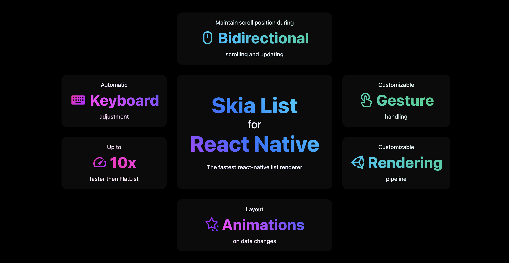

<!-- 
 -->

# React Native Skia List



## Installation

Be aware the library is still in development and not done yet.

```sh
npm install react-native-skia-list
```

## [Documentation](https://samuelscheit.github.io/react-native-skia-list/)

<video width="230" controls loop muted autoPlay playsinline >
  <source src="https://samuelscheit.github.io/react-native-skia-list/demo.mov" type="video/mp4" />
</video>

## Usage

```tsx
import { SkiaScrollView } from "react-native-skia-list";

function App() {
	return (
		<SkiaScrollView
			data={[1, 2, 3, 4, 5, 6, 7, 8, 9, 10]}
			renderItem={({ item }) => <Text>{item}</Text>}
			height={200}
		/>
	);
}
```

## Contributing

See the [contributing guide](https://github.com/SamuelScheit/react-native-skia-list/blob/main/CONTRIBUTING.md) to learn how to contribute to the repository and the development workflow.

## License

MIT
